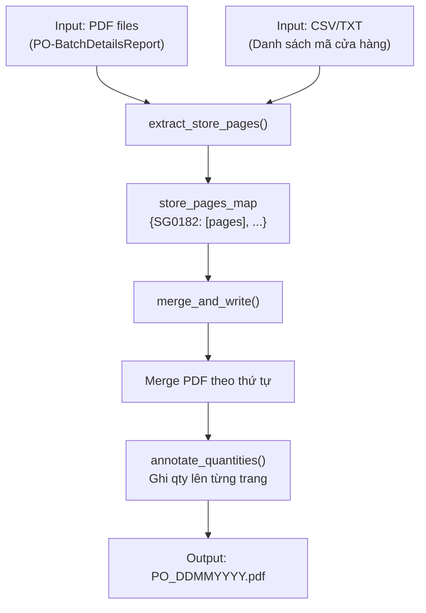
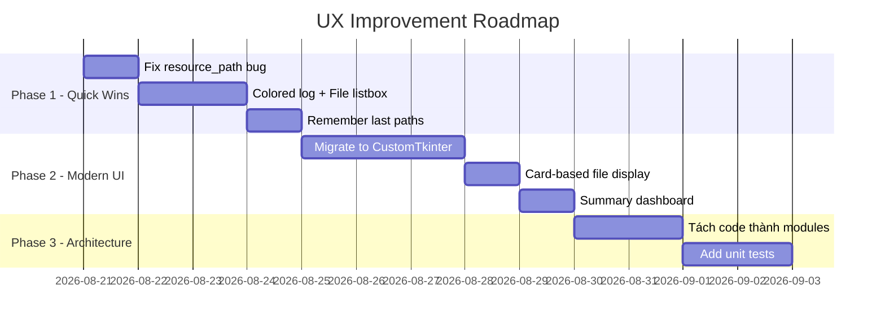

# PO Management Tool — Project Overview & UX Improvement Analysis

## 1. Project Overview

### Mục đích
Tool nội bộ giúp **merge các file PDF Purchase Order (PO)** theo danh sách mã cửa hàng (SG####), annotate số lượng lên từng trang, và xuất file PDF cuối cùng theo thứ tự mong muốn.

### Kiến trúc hiện tại

### File chính

| File | Dòng | Vai trò |
|------|------|---------|
| [`po_merge_tool_gui.py`](file:///p:/LPA/PO_Application/LPA_POP/src/po_merge_tool_gui.py) | 1137 | Monolith: Core logic + CLI + GUI (Tkinter) |
| [`pop.py`](file:///p:/LPA/PO_Application/LPA_POP/src/pop.py) | 80 | Script CLI gốc (legacy, không dùng nữa) |
| [`MCH.csv`](file:///p:/LPA/PO_Application/LPA_POP/MCH.csv) | 116 | Mẫu danh sách cửa hàng (3 cột: mã, tên, staff) |
| [`build.bat`](file:///p:/LPA/PO_Application/LPA_POP/compile/build.bat) | 70 | Build EXE bằng PyInstaller |

### Data Flow (User Workflow hiện tại)
1. Mở app → GUI xuất hiện
2. Chọn file PDF (hoặc folder)
3. Chọn file danh sách mã cửa hàng (CSV/TXT)
4. Chọn nơi lưu output
5. Bấm **"Bắt đầu"**
6. Chờ progress bar → Log hiển thị kết quả
7. Popup "Xong" → Có thể bấm "Mở thư mục PO" hoặc "Xem Staff Mapping"

---

## 2. Đánh giá UX hiện tại — Các vấn đề chính

### 🔴 Critical Issues

#### 2.1. GUI trông "raw" và thiếu hướng dẫn trực quan
- Tkinter native style — trông như ứng dụng Windows XP
- Không có visual hierarchy rõ ràng (label fonts không đồng nhất)
- Không có icon/graphic nào trên giao diện ngoài window icon
- User lần đầu mở app **không biết phải làm gì trước**

#### 2.2. Flow chọn input rối
- [`_choose_input()`](file:///p:/LPA/PO_Application/LPA_POP/src/po_merge_tool_gui.py#L795-L804): Nếu user cancel file dialog → auto mở folder dialog — **rất confusing**
- Input entry hiển thị comma-separated paths — khó đọc khi chọn nhiều file
- Không có cách xóa/chỉnh sửa từng file đã chọn (chỉ có 1 entry text dài)

#### 2.3. Thiếu validation trực quan
- Chỉ validate khi bấm "Bắt đầu" → popup error
- Không có indicator nào cho biết field nào đã được điền đúng
- Không check realtime (file có tồn tại không, CSV có đúng format không)

#### 2.4. Progress feedback quá tối giản
- Chỉ có 1 progress bar + text log
- Không có trạng thái rõ ràng: đang ở bước nào (Extract → Merge → Annotate → Save)
- Log text không phân biệt được level (warning vs info vs error) — tất cả cùng màu

### 🟡 Major Issues

#### 2.5. Output path handling không thân thiện
- Default output là relative path `PO_DDMMYYYY.pdf` — user không biết file sẽ lưu ở đâu
- Nếu user chỉ gõ tên file → file sẽ lưu ở CWD (có thể là `src/`)

#### 2.6. Missing/Extra codes reporting quá thô
- Log chỉ list mã thiếu/dư dưới dạng text — khó đọc khi có nhiều mã
- Không highlight severity (thiếu 1 mã vs thiếu 30 mã → cùng 1 dòng warning)

#### 2.7. Monolithic code — khó maintain
- 1137 dòng trong 1 file: core logic, CLI, GUI, annotation, logging — tất cả trộn lẫn
- Commented-out code blocks (175-231) — dead code

#### 2.8. Icon path issue khi chạy từ `src/`
- `resource_path()` dùng `os.path.abspath(".")` → khi chạy `python src/po_merge_tool_gui.py` từ project root thì OK, nhưng chạy từ trong `src/` thì icon/font path sai

### 🟢 Minor Issues

#### 2.9. Không có Dark mode / Theme switching
#### 2.10. Log text không có horizontal scrollbar (chỉ vertical)
#### 2.11. Không remember lần chọn trước (last used paths)
#### 2.12. "Xem Staff Mapping" button chỉ active sau khi xử lý xong — user không biết nó tồn tại

---

## 3. Đề xuất Approach cải thiện UX

### 🏗️ Approach A: Quick Wins — Cải thiện UX trên Tkinter hiện có
> **Effort**: Thấp (~1-2 ngày) | **Impact**: Trung bình

| # | Cải tiến | Chi tiết |
|---|----------|----------|
| A1 | **Wizard-style flow** | Thêm step indicator (Step 1/3, 2/3, 3/3) — hướng dẫn user từng bước |
| A2 | **Drag & Drop support** | Dùng `tkinterdnd2` để cho phép kéo thả PDF vào app |
| A3 | **File listbox** thay vì entry text | Chọn nhiều file → hiển thị danh sách, có nút xóa từng file |
| A4 | **Real-time validation** | Đổi màu entry border/label khi field hợp lệ (xanh) hoặc lỗi (đỏ) |
| A5 | **Colored log output** | Dùng `tag_config` trên Text widget: WARNING=vàng, ERROR=đỏ, INFO=trắng |
| A6 | **Multi-step progress** | Thay 1 progress bar bằng labeled steps: Extract ✅ → Merge 🔄 → Annotate ⬜ → Done ⬜ |
| A7 | **Remember last paths** | Dùng `json` file lưu last input folder, list file, output dir |
| A8 | **Fix resource_path** | Dùng `__file__` thay vì `os.path.abspath(".")` để resolve assets |

---

### 🎨 Approach B: Modern UI — Chuyển sang CustomTkinter
> **Effort**: Trung bình (~3-5 ngày) | **Impact**: Cao

[CustomTkinter](https://github.com/TomSchimansky/CustomTkinter) là wrapper của Tkinter với modern dark/light theme, rounded widgets.

| # | Cải tiến | Chi tiết |
|---|----------|----------|
| B1 | **Modern dark theme** mặc định | Dark mode professional, bo góc, gradient buttons |
| B2 | **Sidebar navigation** | Thay vì stacked layout → sidebar chọn mode: Merge / Settings / Staff Report |
| B3 | **Card-based file display** | Mỗi PDF file hiển thị như 1 card (tên, size, icon) — có nút X xóa |
| B4 | **Summary dashboard** sau khi chạy | Hiển thị: tổng file, tổng trang, thiếu/dư mã, tổng quantity — dạng card |
| B5 | **Toast notifications** | Thay messagebox popup bằng toast slide-in |
| B6 | **Tooltip hints** | Hover lên mỗi field → giải thích cần làm gì |
| B7 | **Export report** | Sau khi merge, cho user export log/summary ra file riêng |

---

### 🚀 Approach C: Full Redesign — Web-based UI (Flask/FastAPI + HTML)
> **Effort**: Cao (~1-2 tuần) | **Impact**: Rất cao

Chuyển GUI sang web app local (chạy trên `localhost:8080`), dùng modern HTML/CSS/JS.

| # | Cải tiến | Chi tiết |
|---|----------|----------|
| C1 | **Responsive modern UI** | Glassmorphism, animations, dark mode |
| C2 | **Drag & Drop file upload** | Native HTML5 drag & drop |
| C3 | **Real-time progress via WebSocket** | Progress bar + step indicator live update |
| C4 | **Interactive summary report** | After merge: sortable table mã thiếu/dư, chart quantity by staff |
| C5 | **Multi-language support** | Dễ dàng thêm i18n |
| C6 | **History/Recent merges** | Database SQLite lưu lịch sử các lần merge |
| C7 | **Preview PDF** | Xem trước PDF output ngay trên browser |

> ⚠️ **Lưu ý**: Approach C sẽ cần thay đổi cách build EXE (bundle web server + browser). Phức tạp hơn nhưng là hướng đi dài hạn.

---

### 🔧 Approach D: Code Architecture Refactor (nên làm song song)
> **Effort**: Trung bình (~2-3 ngày) | **Impact**: Maintainability

| # | Cải tiến | Chi tiết |
|---|----------|----------|
| D1 | **Tách file** | `core.py` (logic), `gui.py` (UI), `cli.py` (CLI), `utils.py` (helpers) |
| D2 | **Xóa dead code** | Remove commented-out `create_staff_report` block (175-231) |
| D3 | **Config class** | Tập trung tất cả config (pattern, paths, defaults) vào 1 dataclass |
| D4 | **Unit tests** | Test `read_store_list`, `extract_store_pages`, `merge_and_write` riêng biệt |
| D5 | **Type-safe callbacks** | Dùng Protocol/ABC cho progress callbacks thay vì bare Callable |

---

## 4. Đề xuất ưu tiên (Recommended Roadmap)

> [!TIP]
> **Recommendation**: Bắt đầu với **Approach A (Quick Wins)** + **D (Refactor)** trước. Nếu cần modern look, nâng cấp lên **Approach B (CustomTkinter)**. Approach C (Web-based) chỉ nên cân nhắc nếu tool cần scale ra nhiều user hoặc cần deploy remote.

## 5. Open Questions

> [!IMPORTANT]
> 1. **Target user là ai?** Chỉ dùng nội bộ IT hay business users (non-technical)? → Quyết định mức độ đầu tư UI
> 2. **Có cần giữ khả năng build EXE không?** → Ảnh hưởng lựa chọn framework UI
> 3. **Bạn muốn ưu tiên approach nào?** Hay muốn mình implement cụ thể 1 approach?
